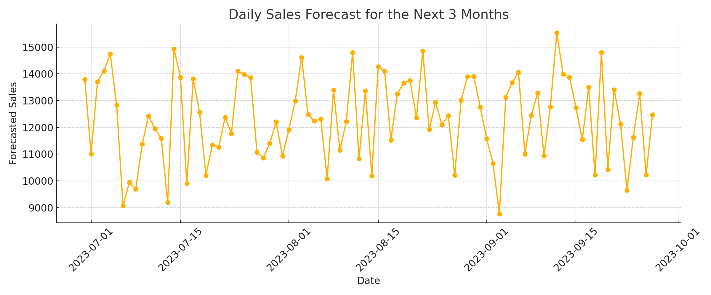

# Retail Sales Forecasting (Linear Regression)

This project demonstrates how to clean a real-world messy dataset, engineer meaningful features, and build a simple but powerful linear regression model to forecast sales for the next 3 months.

## Dataset
Synthetic retail sales data with the following fields:
- Date
- Store
- Customers
- Promotion (Promo)
- Weather
- Day Type (Weekday / Weekend / Holiday)
- Sales (target)

Some columns included missing values and required preprocessing.

## Tasks Covered
- Data Cleaning (handling missing values, encoding)
- Feature Engineering (weekday, encoded categories)
- Regression Modeling with **scikit-learn**
- Forecasting next 90 days of sales
- Data Visualization with **matplotlib**

## Sample Output

## Files
- **sales_forecast_model.ipynb**: Full notebook from data cleaning to forecasting
- **sales_data_dirty.csv**: Raw dataset (simulated)
- **forecast_plot.png**: Final sales prediction chart

## Tools Used
- Python (pandas, numpy, matplotlib, scikit-learn)
